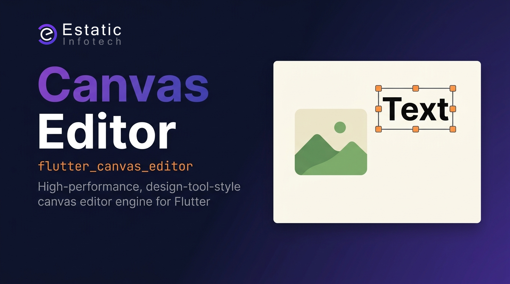

# Canvas Editor (`flutter_canvas_editor`)

[](https://pub.dev/packages/flutter_canvas_editor)

A high-performance, design-tool-style canvas template editor engine for Flutter. It provides an embedded editor canvas widget, a clean controller interface, reactive state streams, customizable selection borders/handles, layer ordering, undo/redo history, text reflow, background fill (color and image), callback-based image loading, dynamic custom node extension, and pixel-identical PNG export.

The library owns the **canvas engine only** — toolbars, insert bars, property panels, and colour pickers are built by the consumer app around the controller.

---

## Getting Started

### Installation

```yaml
dependencies:
  flutter_canvas_editor: ^1.2.0
```

Then:

```dart
import 'package:flutter_canvas_editor/flutter_canvas_editor.dart';
```

For local development against this repo:

```yaml
dependencies:
  flutter_canvas_editor:
    path: /path/to/canvas_editor
```

### Minimal Example

A runnable example app lives in [`example/`](example/). From the package root:

```bash
cd example
flutter run
flutter run -d chrome
```

Or embed the editor directly:

```dart
import 'package:flutter/material.dart';
import 'package:flutter_canvas_editor/flutter_canvas_editor.dart';

void main() => runApp(const MyApp());

class MyApp extends StatelessWidget {
  const MyApp({super.key});
  @override
  Widget build(BuildContext context) => const MaterialApp(
        home: CanvasDemoScreen(),
      );
}

class CanvasDemoScreen extends StatefulWidget {
  const CanvasDemoScreen({super.key});
  @override
  State<CanvasDemoScreen> createState() => _CanvasDemoScreenState();
}

class _CanvasDemoScreenState extends State<CanvasDemoScreen> {
  late final CanvasEditorController _controller;

  @override
  void initState() {
    super.initState();
    _controller = CanvasEditorController(
      initialDocument: const DesignDocument(
        id: 'demo',
        version: 1,
        width: 1080,
        height: 1080,
        nodes: [],
      ),
    );
  }

  @override
  void dispose() {
    _controller.dispose();
    super.dispose();
  }

  @override
  Widget build(BuildContext context) => Scaffold(
        appBar: AppBar(title: const Text('Canvas Demo')),
        body: CanvasEditorWidget(controller: _controller),
      );
}
```

---

## Architecture

| Concern | Owner |
|---|---|
| Canvas rendering, gestures, selection, undo/redo | `flutter_canvas_editor` package |
| Toolbars, insert bars, property panels, routing | Consumer app |
| Document persistence / autosave | Consumer app (via `onDocumentChanged` — fires on commit, not mid-drag) |
| Live selection / chrome UI | Consumer app (via `stateStream`) |
| Remote / bundled image resolution | Consumer app (via `imageProvider`) |

`CanvasEditorWidget` is **zero chrome** — embed it inside your layout and drive it through `CanvasEditorController`, similar to `TextEditingController`.

---

## How to Use

### Basic Initialization & Widget Integration

```dart
import 'package:flutter/material.dart';
import 'package:flutter_canvas_editor/flutter_canvas_editor.dart';

class MyCanvasEditorScreen extends StatefulWidget {
  const MyCanvasEditorScreen({super.key});

  @override
  State<MyCanvasEditorScreen> createState() => _MyCanvasEditorScreenState();
}

class _MyCanvasEditorScreenState extends State<MyCanvasEditorScreen> {
  late final CanvasEditorController _controller;

  @override
  void initState() {
    super.initState();

    _controller = CanvasEditorController(
      initialDocument: const DesignDocument(
        id: 'new_doc_123',
        version: 1,
        width: 1080,
        height: 1080,
        nodes: [
          BackgroundNode(
            id: 'bg_1',
            frame: Rect.fromLTWH(0, 0, 1080, 1080),
            zIndex: 0,
            color: '#FFFFFFFF',
          ),
          TextNode(
            id: 'text_1',
            frame: Rect.fromLTWH(140, 200, 800, 120),
            zIndex: 1,
            text: 'Editable Canvas Template',
          ),
        ],
      ),
      // Resolve asset IDs (e.g. CDN URLs) to ImageProviders
      imageProvider: (ref) => NetworkImage(ref.assetId!),
      onDocumentChanged: (document) {
        final json = document.toJson();
        debugPrint('Autosave: $json');
      },
    );
  }

  @override
  void dispose() {
    _controller.dispose();
    super.dispose();
  }

  @override
  Widget build(BuildContext context) {
    return Scaffold(
      appBar: AppBar(
        title: const Text('Design Editor'),
        actions: [
          IconButton(
            icon: const Icon(Icons.undo),
            onPressed: _controller.state.canUndo ? _controller.undo : null,
          ),
          IconButton(
            icon: const Icon(Icons.redo),
            onPressed: _controller.state.canRedo ? _controller.redo : null,
          ),
        ],
      ),
      body: Row(
        children: [
          Expanded(
            child: CanvasEditorWidget(
              controller: _controller,
              theme: const CanvasTheme(
                handleColor: Colors.blue,
                selectionBorderColor: Colors.blueAccent,
                handleSize: 10.0,
              ),
            ),
          ),
          SizedBox(
            width: 300,
            child: StreamBuilder<CanvasEditorState>(
              stream: _controller.stateStream,
              builder: (context, snapshot) {
                final selectedNode = snapshot.data?.selectedNode;

                if (selectedNode is TextNode) {
                  return Column(
                    children: [
                      const Text('Edit Text Properties'),
                      TextField(
                        controller: TextEditingController(text: selectedNode.text),
                        onSubmitted: (value) =>
                            _controller.updateTextContent(selectedNode.id, value),
                      ),
                      ElevatedButton(
                        onPressed: () => _controller.updateTextStyle(
                          selectedNode.id,
                          fontSize: selectedNode.fontSize + 4,
                        ),
                        child: const Text('Increase Font Size'),
                      ),
                    ],
                  );
                }
                return const Center(child: Text('Select an element to edit'));
              },
            ),
          ),
        ],
      ),
    );
  }
}
```

---

## Controller API

### Construction

```dart
_controller = CanvasEditorController({
  DesignDocument? initialDocument,
  CanvasImageProvider? imageProvider,
  List<CustomNodeType>? customNodeTypes,
  void Function(DesignDocument doc)? onDocumentChanged,
});
```

| Parameter | Purpose |
|---|---|
| `initialDocument` | Starting canvas state. Defaults to a 1080×1080 white background. |
| `imageProvider` | Required for `assetId` / remote / bundled assets, and for every image on web (see [Image Loading](#image-loading)). Optional for `localPath`-only Hosts on Android, iOS, and desktop. |
| `customNodeTypes` | Registers consumer-defined node types on this Controller only. |
| `onDocumentChanged` | Fires when a Design Document change is **committed** (same moments as undo: gesture end, add/delete, style commit, undo/redo, load). Mid-drag/resize/rotate updates go to `stateStream` only. Use for Host dirty/autosave — not undo depth. |

### Read API

```dart
DesignDocument get document;
CanvasEditorState get state;
Stream<CanvasEditorState> get stateStream;
```

`CanvasEditorState` exposes:

| Field | Description |
|---|---|
| `document` | Current `DesignDocument` snapshot |
| `selectedNode` | Selected `DesignNode`, or `null` |
| `canUndo` / `canRedo` | Whether history navigation is available |

Persistence dirty state is **Host-owned**. Prefer `onDocumentChanged` (Committed Changes) — do not treat undo-stack depth as “unsaved.” (`hasUnsavedChanges` is deprecated and will be removed in 2.0.)

### Selection

```dart
controller.selectNode(nodeId);   // select a node
controller.selectNode(null);     // clear selection
```

### Node Management

```dart
controller.addTextNode({String? text, Offset? position, bool select = true});
controller.addImageNode({required String localPath, bool select = true});
// Web: localPath cannot be read. Use an ImageNode with assetId instead.
controller.deleteNode(String nodeId);
```

### Text Styling & Content

Text updates automatically **reflow** — frame height adjusts to fit wrapped text while width is held.

```dart
controller.updateTextStyle(
  nodeId, {
  double? fontSize,
  String? textColor,      // ARGB hex, e.g. '#FF000000' — see Document Color helpers
  String? fontFamily,     // Host-registered face; null = platform default
  int? fontWeight,        // e.g. 400, 700
  double? lineHeight,
  double? letterSpacing,
  String? textAlign,      // 'left', 'center', 'right'
  bool recordUndo = true,
});

controller.updateTextContent(nodeId, String text, {bool recordUndo = true});
```

### Document Color helpers

Controller mutators keep Document Color as `#AARRGGBB` hex. Convert at the Host UI boundary:

```dart
import 'package:flutter/material.dart';
import 'package:flutter_canvas_editor/flutter_canvas_editor.dart';

// Colour picker → Controller
final hex = encodeDocumentColor(pickedColor);
controller.updateBackground(hex);
controller.updateTextStyle(nodeId, textColor: hex);

// Design Document → Colour picker
final color = decodeDocumentColor(node.textColor);
```

### Background

```dart
// Replace-fill: sets solid color and clears any Background Fill image
controller.updateBackground('#FFFFFFFF', {bool recordUndo = true});

// Set a background image (localPath and assetId are exclusive)
controller.setBackgroundImage(localPath: '/path/to/photo.jpg');
controller.setBackgroundImage(assetId: 'https://cdn.example.com/bg.png');

// Restore dormant background colour (keeps the last solid color)
controller.clearBackgroundImage();
```

### Layer Ordering

```dart
controller.bringForward(nodeId);
controller.sendBackward(nodeId);
controller.bringToFront(nodeId);
controller.sendToBack(nodeId);
```

### History

```dart
controller.undo();
controller.redo();
```

#### Coalesced undo for live controls (sliders, colour pickers)

Use a history session to group many mid-gesture writes into a single undo step:

```dart
_controller.beginHistorySession();

// Live updates during drag — no undo step per tick
_controller.updateTextStyle(nodeId, fontSize: 32, recordUndo: false);
_controller.updateTextStyle(nodeId, fontSize: 36, recordUndo: false);

// One undo step for the whole gesture
_controller.commitHistorySession();
```

`updateTextStyle`, `updateTextContent`, and `updateBackground` all support `recordUndo: false` for this pattern.

### Document Persistence

```dart
final json = controller.document.toJson();
// Save json to file / database

final restored = DesignDocument.fromJson(json);
controller.loadDocument(restored);
```

### Export

```dart
final Uint8List pngBytes = await controller.exportToPng(pixelRatio: 2.0);
```

Export uses the same rendering pipeline as the live canvas, so output is pixel-identical. Pass a higher `pixelRatio` for retina-quality output.

---

## Built-in Canvas Interactions

The canvas **fits to its parent** (letterboxed). There is no Host zoom/pan or viewport Controller API.

Gestures out of the box — no extra wiring required:

| Gesture | Behaviour |
|---|---|
| Tap empty area | Deselect |
| Tap node | Select |
| Tap selected text node again | Start inline text editing |
| Drag node | Move |
| Corner handles (image / custom nodes) | Resize (all corners) |
| Side handles (text nodes) | Horizontal resize only (design-tool-style); height reflows to fit wrapped text |
| Rotation handle | Rotate around node centre |

Text nodes use **horizontal-only resize handles** on the left and right sides. When text wraps, frame height is recalculated automatically to fit the text.

Inline editing replaces the painted glyphs with a single transparent field in the node frame. It uses the node's font, size, line height, letter spacing, colour, and alignment — not the Host `TextField` theme — so the caret text stays where the canvas text was. Tap outside the field to commit.

---

## Platform support

| Platform | Status |
|---|---|
| Android | ✅ |
| iOS | ✅ |
| macOS | ✅ |
| Windows | ✅ |
| Linux | ✅ |
| Web | ✅ (`assetId` + `imageProvider`; `localPath` is IO-only) |

---

## Fonts

The Engine does **not** bundle fonts. New Text Nodes default to the **platform face** (`fontFamily: null`). If you store a custom Node Font Family on the Design Document, register that family in the Host app (e.g. `pubspec.yaml` `fonts:`).

---

## Image Loading

Images are referenced by `localPath` (device file) and/or `assetId` (opaque ID resolved by the Host). On Android, iOS, and desktop the Engine tries `localPath` first, then falls back to `imageProvider`.

On **web** there is no file system, so `localPath` is skipped. Use `assetId` with `imageProvider` (`NetworkImage`, `AssetImage`, or `MemoryImage`). `addImageNode` reads a local file to size the node and is limited to IO platforms; on web, put an `ImageNode` with `assetId` on the Design Document (or `loadDocument`).

**`imageProvider` is required only for `assetId` / remote / bundled assets.** Gallery `localPath`-only Hosts on IO platforms can omit it — do not register a no-op callback “just in case.”

```dart
// localPath-only Hosts: omit imageProvider entirely
CanvasEditorController(initialDocument: doc);

// Mixed sources — one callback branches file / network / internal asset
CanvasEditorController(
  imageProvider: (CanvasImageReference ref) {
    final id = ref.assetId;
    if (id == null || id.isEmpty) {
      throw ArgumentError('assetId required when localPath is unresolved');
    }
    // Host convention: opaque assetId prefixes
    if (id.startsWith('http://') || id.startsWith('https://')) {
      return NetworkImage(id);
    }
    if (id.startsWith('asset:')) {
      return AssetImage(id.substring('asset:'.length));
    }
    return NetworkImage(id); // or your CDN / catalog lookup
  },
);
```

`CanvasImageReference`, `CanvasImageLoader`, and `CanvasImageProvider` are exported for advanced use (e.g. preloading images before export).

`ImageNode` supports `localPath`, `assetId`, and `fit` modes: `'cover'`, `'contain'`, `'fill'`.

---

## Document Model

`DesignDocument` is the single serializable unit. All frame values are in **document space** (not screen pixels). The library converts between document and viewport coordinates internally via `CoordinateSystem`.

### Built-in node types

| Type | Class | Key fields |
|---|---|---|
| `background` | `BackgroundNode` | `color`, `localPath`, `assetId` |
| `text` | `TextNode` | `text`, `fontFamily`, `fontSize`, `fontWeight`, `lineHeight`, `letterSpacing`, `textColor`, `textAlign` |
| `image` | `ImageNode` | `localPath`, `assetId`, `fit` |

All nodes share a common transform model:

```dart
Rect frame;       // position and size in document space
int zIndex;
double rotation;  // degrees
double scaleX;
double scaleY;
```

### Registering Custom Nodes

Custom Node types are **scoped per Controller** (pass `customNodeTypes` at construct). Deserialize with that registry:

```dart
final customNodeTypes = [
  CustomNodeType<MyBadge>(
    type: 'my_badge',
    fromJson: (json) => MyBadge.fromJson(json),
    builder: (context, node) => MyBadgeWidget(label: node.label),
  ),
];

final controller = CanvasEditorController(customNodeTypes: customNodeTypes);

// Parse JSON against this Controller's registry
final doc = controller.documentFromJson(jsonMap);
// or: DesignDocument.fromJson(jsonMap, customNodes: controller.customNodeRegistry);
```

Static `CustomNodeRegistry.register` / `registerAll` are deprecated (removed in 2.0).

Custom node types participate in serialization, rendering, and transforms.

---

## Theming

Pass a `CanvasTheme` to `CanvasEditorWidget` to style selection chrome:

```dart
CanvasEditorWidget(
  controller: _controller,
  theme: const CanvasTheme(
    handleColor: Colors.blue,
    handleSize: 8.0,
    selectionBorderColor: Colors.blue,
    selectionBorderWidth: 1.5,
    // Optional — defaults to selectionBorderColor when omitted
    // rotationHandleColor: Colors.orange,
  ),
);
```

---

## Public Exports

The barrel file `package:flutter_canvas_editor/flutter_canvas_editor.dart` exports:

| Symbol | Purpose |
|---|---|
| `CanvasEditorController` | Primary write/read API |
| `CanvasEditorState` | Reactive state snapshot |
| `CanvasEditorWidget` | Embeddable canvas widget |
| `CanvasTheme` | Selection handle / border theming |
| `DesignDocument`, `DesignNode`, `TextNode`, `ImageNode`, `BackgroundNode` | Document model |
| `encodeDocumentColor`, `decodeDocumentColor` | Flutter `Color` ↔ Document Color hex |
| `CustomNodeType`, `CustomNodeRegistry` | Per-Controller node extension registry |
| `CoordinateSystem` | Doc ↔ screen mapping for custom overlays (most Hosts can ignore) |
| `CanvasImageReference`, `CanvasImageLoader`, `CanvasImageProvider` | Image load path |

Embed the canvas with `CanvasEditorWidget`. Symbols not listed here are not part of the public API.

---

## License

MIT — see [LICENSE](LICENSE).

---

## Key Features Summary

1. **Embedded editor engine** — zero chrome; consumer owns all UI around the canvas
2. **Controller + state stream** — drive the canvas from Host UI through the public controller
3. **Document manipulation** — add/delete text and image nodes, update styles, background colour and image
4. **Text reflow** — automatic height adjustment when content or width changes
5. **design-tool-style text resize** — horizontal side handles only; height follows wrapped text
6. **Inline text editing** — tap a selected text node again; one field, same metrics as the canvas text
7. **Drag, resize, rotate** — built-in gesture handling with rotation anchor
8. **Layer reordering** — bring forward / send backward / to front / to back
9. **Undo / redo** — with history session coalescing for live property controls
10. **Callback image loading** — `localPath` + `assetId` with consumer-provided resolver
11. **Custom node registry** — per-Controller extension with widgets and serializers
12. **Pixel-identical PNG export** — same renderer as the live canvas
13. **JSON serialization** — `DesignDocument.toJson()` / `fromJson()` for persistence and sync
